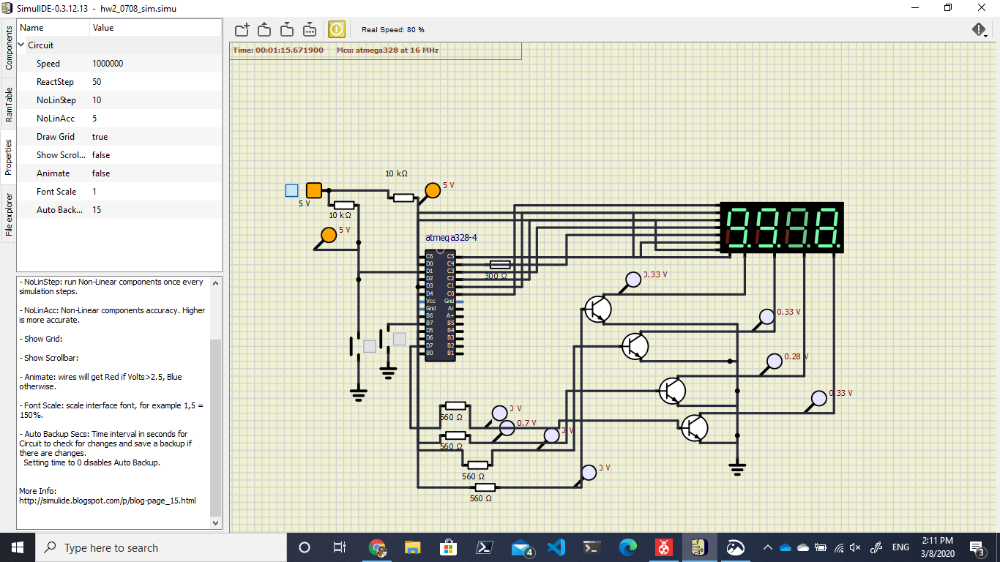

# 7.8 Push and Pulled Switched and 7-segments using BJT (Transistor)
The Idea of this is similar to hw7.6 but it more change to many 7 segments

Handling logic 1 to transistor each one for hold logic 5 millisecond and change the number when we add for 50 times because 5 x 4 (Row of Number there are 0-9999) = 20 and 20x50 = 1,000 as 1000 millisecond or 1 second.

- Theethawat Savastham 2020-03-08 
